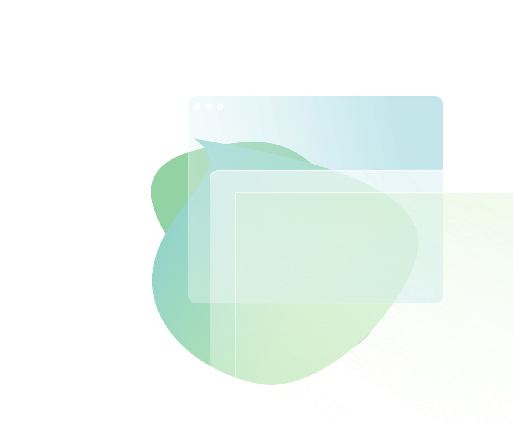

<h2><b>Cheers, I am Pierre!</b></h2>

You have reached a full stack .NET developer and long time hobby web designer living in Sweden. 

I have created websites for organizations and business owners such as rentpersonligt, and am currently interning for Else in Gothenburg. 

Here is a list of my favorite tools: 
 - Terminal
 - VS Code & VS
 - Inkscape
 - GitHub

🌱 Struggling on [advent of code 8/25](https://github.com/pirren/adventofcode2020)

<!--
**pirren/pirren** is a ✨ _special_ ✨ repository because its `README.md` (this file) appears on your GitHub profile.

Here are some ideas to get you started:

- 🔭 I’m currently working on ...
- 👯 I’m looking to collaborate on ...

- 💬 Ask me about ...
- 📫 How to reach me: ...
- 😄 Pronouns: ...
- ⚡ Fun fact: ...
-->

<!--  -->
